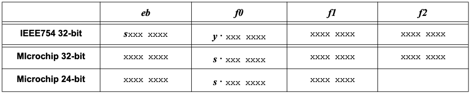

# AN575
Python module to convert between Microchip's 32/24-bit float format numbers as described in Application Note AN575 and IEEE Standard for Floating-Point Arithmetic (IEEE-754) 32-bit float format numbers.

[](https://www.gnu.org/licenses/lgpl-3.0)

## Install
```sh
$ python3 -m pip install -v --user git+https://github.com/latchdevel/AN575.git
```

## Tests
AN575 provides a unit tests module to verify its correct operation:
```sh
$ python3 -m unittest discover -v AN575
```

## Usage
```python
>>> from AN575 import FloatToAN575, AN575ToFloat
>>>
>>> FloatToAN575(0.0014662742614746094).hex()
'75403000'
>>>
>>> AN575ToFloat(*bytes.fromhex('75403000'))
0.0014662742614746094
>>>
>>> AN575ToFloat(*b'\x75\x40\x30')
0.0014662742614746094
>>> 
>>> AN575ToFloat(0x75,0x40,0x30)
0.0014662742614746094
>>>
```

# Application Note AN575
[Microchip Application Note 00575 (1997) IEEE 754 Compliant Floating Point Routines](http://ww1.microchip.com/downloads/en/AppNotes/00575.pdf)

This application note presents an implementation of floating point math routines for the Microchip PICmicro microcontroller PIC16/17/18 families.
Routines are provided in a modified IEEE 754 32-bit format together with versions in 24-bit reduced format.

## Floating Point formats
In what follows, we use the following floating point formats:



Legend: **`s`** is the Sign bit, **`y`** = LSB of eb register, **`⋅`** = radix point

## AN575 32/24 bit formats
```
  Format    Resolution    Range
  32 bit    7.2 digits    +/- 3.4e38, +/- 1.1e-38
  24 bit    4.8 digits    +/- 3.4e38, +/- 1.1e-38

32 bit floating point format:

  address ID
  X       a.low8  : LSB, bit 0-7 of mantissa
  X+1     a.midL8 : bit 8-15 of mantissa
  X+2     a.midH8 : bit 16-22 of mantissa, bit 23: sign bit
  X+3     a.high8 : MSB, bit 0-7 of exponent, with bias 0x7F

  bit 23 of mantissa is a hidden bit, always equal to 1
  zero (0.0) :  a.high8 = 0 (mantissa & sign ignored)

  MSB     LSB
  7F 00 00 00 :  1.0   =  1.0  * 2**(0x7F-0x7F) =  1.0  * 1
  7F 80 00 00 : -1.0   = -1.0  * 2**(0x7F-0x7F) = -1.0  * 1
  80 00 00 00 :  2.0   =  1.0  * 2**(0x80-0x7F) =  1.0  * 2
  80 40 00 00 :  3.0   =  1.5  * 2**(0x80-0x7F) =  1.5  * 2
  7E 60 00 00 :  0.875 =  1.75 * 2**(0x7E-0x7F) =  1.75 * 0.5
  7F 60 00 00 :  1.75  =  1.75 * 2**(0x7E-0x7F) =  1.75 * 1
  7F 7F FF FF :  1.9999998808

  00 7C E3 5A : 0.0 (mantissa & sign ignored)
  00 00 00 00 : 0.0

  01 00 00 00 : 1.1754943508e-38 : smallest number above zero
  FE 7F FF FF : 3.4028234664e+38 : largest number

  FF 00 00 00 : +INF : positive infinity
  FF 80 00 00 : -INF : negative infinity

24 bit floating point format:

  address  ID
  X        a.low8  : LSB, bit 0-7 of mantissa
  X+1      a.mid8  : bit 8-14 of mantissa, bit 15: sign bit
  X+2      a.high8 : MSB, bit 0-7 of exponent, with bias 0x7F

  bit 15 of mantissa is a hidden bit, always equal to 1
  zero (0.0) :  a.high8 = 0 (mantissa & sign ignored)

  MSB  LSB
  7F 00 00  :  1.0   =  1.0  * 2**(0x7F-0x7F) =  1.0  * 1
  7F 80 00  : -1.0   = -1.0  * 2**(0x7F-0x7F) = -1.0  * 1
  80 00 00  :  2.0   =  1.0  * 2**(0x80-0x7F) =  1.0  * 2
  80 40 00  :  3.0   =  1.5  * 2**(0x80-0x7F) =  1.5  * 2
  7E 60 00  :  0.875 =  1.75 * 2**(0x7E-0x7F) =  1.75 * 0.5
  7F 60 00  :  1.75  =  1.75 * 2**(0x7E-0x7F) =  1.75 * 1
  7F 7F FF  :  1.999969482

  00 7C 5A  : 0.0 (mantissa & sign ignored)

  01 00 00  : 1.17549435e-38 : smallest number above zero
  FE 7F FF  : 3.40277175e+38 : largest number

  FF 00 00  : +INF : positive infinity
  FF 80 00  : -INF : negative infinity
```

# License
Copyright (c) 2023 Jorge Rivera. All right reserved.

License GNU Lesser General Public License v3.0.

This program is free software; you can redistribute it and/or
modify it under the terms of the GNU Lesser General Public
License as published by the Free Software Foundation; either
version 3 of the License, or (at your option) any later version.

This program is distributed in the hope that it will be useful,
but WITHOUT ANY WARRANTY; without even the implied warranty of
MERCHANTABILITY or FITNESS FOR A PARTICULAR PURPOSE.  See the GNU
Lesser General Public License for more details.

You should have received a copy of the GNU Lesser General Public License
along with this program; if not, write to the Free Software Foundation,
Inc., 51 Franklin Street, Fifth Floor, Boston, MA  02110-1301, USA.

See the [LICENSE](LICENSE.txt) file for license rights and limitations (lgpl-3.0).